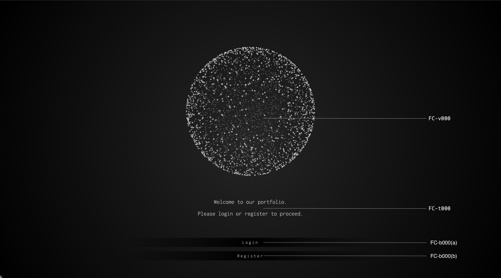

# [A-000] Home

## Screen Design

## Description

A-000 is the first page a user visits.

After displaying the welcome message,  
it displays a button that takes the user to the login or registration page.

## Components

| ID         | Component         | Z-Index |
| :--------- | :---------------- | :-----: |
| FC-v000    | SphereCanvas      |    5    |
| FC-t000    | SequentialMessage |    5    |
| FC-b000(a) | PrimaryButton     |   10    |
| FC-b000(b) | PrimaryButton     |   10    |

## Page Links

| ID  | App Route |
| :-- | :-------- |
| (a) | /login    |
| (b) | /register |

## Table Relations

None
