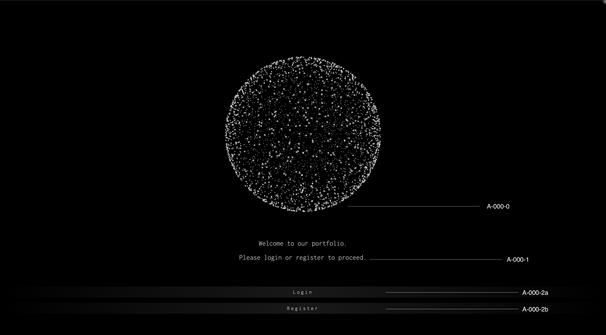

# [A-000] Home

## Screen Design

## Description

A-000 is the first page a user visits.

After displaying the welcome message,  
it displays a button that takes the user to the login or registration page.

## Components

| ID       | Component         | Z-Index |
| :------- | :---------------- | :-----: |
| A-000-0  | SphereCanvas      |    5    |
| A-000-1  | SequentialMessage |    5    |
| A-000-2a | PrimaryButton     |   10    |
| A-000-2b | PrimaryButton     |   10    |

## Page Links

| ID       | App Route |
| :------- | :-------- |
| A-000-2a | /login    |
| A-000-2b | /register |

## Table Relations

None
